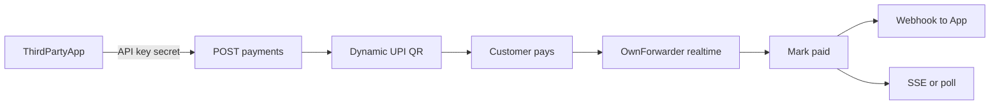
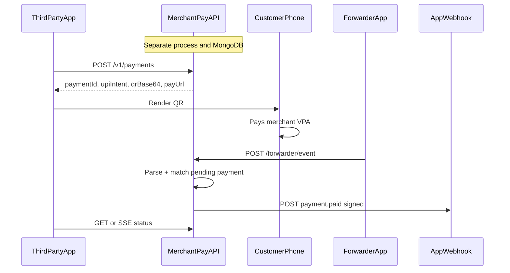
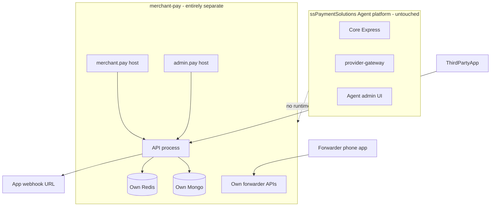
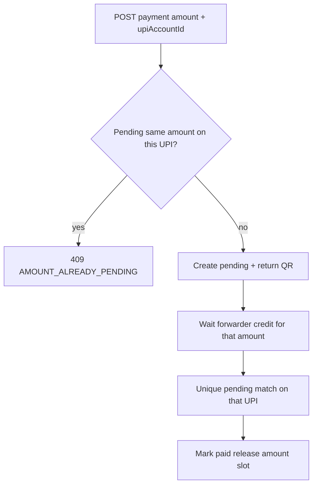
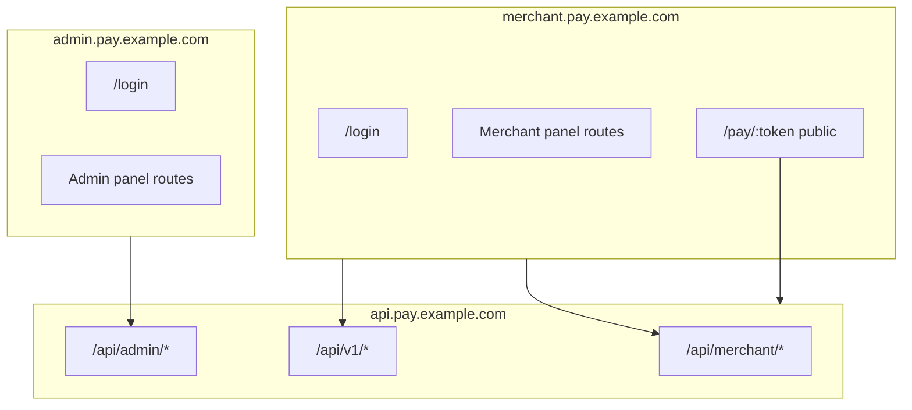

# Developer Payment API — Fully Separate System

## Product positioning

This is a **standalone payment product** for apps to integrate — not a module inside ssPaymentSolutions Core, not an agent desk, not provider-gateway.

Integrators get:
1. Authenticate with **API key + secret**
2. **Create a payment** → **random/dynamic UPI QR** on a chosen merchant VPA
3. Show QR in their app
4. **Realtime confirmation** via this system’s own forwarder match → webhook / SSE / poll
5. Settlement on the merchant’s VPA — we provide QR + verification tech only



## Separation mandate (entirely separate application)

This is **not** a folder inside [`ssPaymentSolutions`](file:///Users/krishnaparasrampuria/ssPaymentSolutions). It is its own application: own directory, own git history, own docs, own editor workspace.

| Layer | Existing agent platform | This product |
|-------|-------------------------|--------------|
| **Directory / repo** | `~/…/ssPaymentSolutions` | **Sibling (or elsewhere)** e.g. `~/…/merchant-pay` — **own git repo**, not a subfolder of ssPaymentSolutions |
| **Editor workspace** | Current Cursor window on ssPaymentSolutions | **Separate Cursor/VS Code window** via `merchant-pay.code-workspace` — implement and review only in that workspace |
| **Documentation** | Agent platform README/docs | **Own docs** in the new repo (`README.md`, `docs/`, OpenAPI) — do not document this product inside ssPaymentSolutions |
| Process | Core Express + gateway Nest | Own Node process, own port |
| Database | Current Mongo | Own Mongo URI — no shared collections |
| Redis | Core Redis | Own Redis URI |
| Auth | Agent/admin JWT | Own merchant users + API keys + platform admins |
| Forwarder | Core `/api/forwarder/*` | Own forwarder APIs + tokens |
| UI | Agent frontend | Separate merchant URL + admin URL apps |
| Deploy | Existing host | Independent deploy, env, domains |

**Directory layout (outside ssPaymentSolutions):**

```
/Users/krishnaparasrampuria/
  ssPaymentSolutions/          # existing agent platform — DO NOT put this product here
  merchant-pay/                # NEW application (own repo)
    merchant-pay.code-workspace
    README.md
    docs/                      # product + developer docs (separate document set)
    apps/api/
    apps/merchant-web/
    apps/admin-web/
    packages/shared/
    docker-compose.yml
    .env.example
    .git/
```

**Workspace rule:** When implementation starts, open `merchant-pay` (or `merchant-pay.code-workspace`) in a **new Cursor window**. Do not add `merchant-pay/` under ssPaymentSolutions; do not mix PRs/commits across the two repos.

**Reuse allowed:** ideas/patterns only — copy/adapt into the new repo if useful. No runtime imports from Core, no monorepo workspace linking to ssPaymentSolutions.

**Not shared:** agent users, banks, transactions, ledger, branches, capacity, commissions, provider-gateway, Core forwarder, ssPaymentSolutions docs/issues as the home for this product.

## Non-negotiable product rules

1. **Entirely separate application** — own directory, own git repo, own docs, own Cursor workspace window, own DB/process/UI/forwarder/deploy.
2. **No provider-gateway** — never poll providers, sync banks, or call gateway status APIs.
3. **We generate the QR** — this service builds a fresh `upi://pay?...` per payment and returns intent + QR image/data.
4. **Own forwarder is the only auto-verifier** — SMS / UPI app notify match in near-realtime; optional manual UTR fallback.
5. **Developer-first credentials** — merchant create issues `apiKey` + `apiSecret`.
6. **Realtime status for apps** — webhook + SSE/poll on match.
7. **No same-amount pending per UPI** — at most one pending payment per amount per UPI account; else `AMOUNT_ALREADY_PENDING`.
8. **Multiple UPI ids per merchant** — each payment targets exactly one `upiAccountId`.
9. **UPI app required on add** — `upiProvider` (PhonePe, Google Pay, …) for forwarder app-notification matching.

## How this differs from today’s platform

| Today (agent liquidity) | This product (separate developer payment API) |
|-------------------------|-----------------------------------------------|
| Same Core process / DB | **Isolated service + DB** |
| Demand from admin / provider-gateway | Demand from **integrating apps** via `/api/v1` |
| Static uploaded QR | **Dynamic** QR per payment |
| Status via gateway → provider | Webhook + SSE/poll to the app |
| Agent capacity / branches | Merchant VPA + own forwarder only |
| Ops-centric agent UI | Own developer APIs + docs + dashboard |

**Inspired by** existing stack (Express, Mongo, Redis, React, forwarder concept) — **not embedded in it**.

---

## High-level architecture (standalone repo)

All of this lives under the **separate** `merchant-pay` directory/repo (sibling to ssPaymentSolutions), opened as its own workspace:

```
merchant-pay/                    # OWN directory + OWN git repo
  merchant-pay.code-workspace    # open this in a separate Cursor window
  README.md                      # app overview, setup, deploy
  docs/
    architecture.md
    developer-api.md             # integrator guide (keys, payments, webhooks)
    forwarder-setup.md
    admin-runbook.md
  apps/api/                      # /api/v1, forwarder, merchant BFF, admin BFF
  apps/merchant-web/
  apps/admin-web/
  packages/shared/
  docker-compose.yml
  .env.example
```

**Separate panel URLs (required):**

| Surface | Example URL | App |
|---------|-------------|-----|
| Merchant panel | `https://merchant.pay.example.com` | `apps/merchant-web` |
| Admin panel | `https://admin.pay.example.com` | `apps/admin-web` |
| Public pay page | `https://pay.example.com/p/:token` (or under merchant host `/pay/:token`) | merchant-web or tiny public app |
| API | `https://api.pay.example.com` | `apps/api` |

Merchant and admin are **different origins** — separate builds, separate deploys, separate logins. No shared `/admin` vs `/app` path on one host. A merchant JWT must not unlock admin UI (and vice versa); cookies/tokens scoped per origin.





Forwarder mobile app: either a **dedicated build/config** pointing at merchant-pay base URL, or the same APK with a configurable API base — must **not** register against Core’s `/api/forwarder`.

---

## Domain model (new)

### `Merchant`
- `name`, `slug`, `status` (active/suspended)
- **API credentials (third-party integration)**
  - `apiKey` — public identifier, unique indexed (e.g. `mk_live_…`), shown in dashboard, safe to put in server config
  - `apiSecretHash` — **bcrypt/argon hash only** of the secret; plaintext secret shown **once** at create/rotate
  - `apiSecretLastFour` — optional hint for UI
  - `apiCredentialsRotatedAt`, `apiCredentialsRevokedAt`
- `webhookUrl`, `webhookSecret` (HMAC signing for **outbound** callbacks — separate from API secret)
- `webhookHeaders` optional
- Soft settings: order TTL (e.g. 15 min), allow amount edit, success redirect URL for pay page

**On merchant create (admin or self-serve signup):** generate `apiKey` + high-entropy `apiSecret`, store hash, return both in the create response once. Dashboard can reveal key anytime; secret requires **rotate** to get a new plaintext value.

### `MerchantUser` (own collection — not Core `User`)
- `merchantId`, email/password (or invite flow), `role: merchant_admin | merchant_staff`
- Own JWT issuer/secret for dashboard login in merchant-pay only
- Third-party apps use API key + secret, not staff passwords

### `PlatformAdmin` (own collection)
- Platform operators for **admin panel** (not a merchant)
- `email`, password hash, `role: superadmin | support`
- Login only on **admin panel host** (`admin.pay…/login`); JWT claim `audience: platform_admin`
- Can create/suspend merchants, view all payments, inspect forwarder logs, reprocess matches
- Never served from merchant panel origin

### `MerchantUpiAccount` (merchant’s “added UPI” — many per merchant)

Merchants can register **multiple** UPI ids. Each is an independent QR target with its own same-amount pending lock and app-matching rule.

- `merchantId`, `upiId` (VPA, unique per merchant), `displayName` (`pn`)
- **`upiProvider` (required)** — which UPI **app** this VPA’s credit notifications come from. Explicit user choice in UI/API (not only auto-detect from handle). Enum/list aligned with [`src/utils/upiProvider.js`](src/utils/upiProvider.js): PhonePe, Google Pay, Paytm, BHIM, Amazon Pay, WhatsApp Pay, etc.
  - On add: require `upiProvider` in the form (“Which app is this UPI id?”)
  - Optionally **suggest** from VPA handle via `detectUpiProvider`, but merchant must confirm/override (handles can be wrong for multi-app / bank handles)
- `upiType: 'merchant' | 'personal'`
- `isDefault` — optional default when API omits `upiAccountId` and only one active exists; if multiple active and no id passed → `UPI_ACCOUNT_REQUIRED`
- `isActive`, `forwarderUserId` — paired device that receives that app’s notifies / SMS for this VPA
- Unique index: `{ merchantId, upiId }`

**Add-UPI UX/API fields:** `upiId`, `displayName`, **`upiProvider` (required select)**, `upiType`, optional set-as-default.

### `MerchantOrder` (API resource: **Payment**)
- `merchantId`, **`upiAccountId` (required)** — which of the merchant’s UPIs the QR targets
- `amount` (INR, 2 dp), `currency: 'INR'`
- `status`: `pending | paid | expired | cancelled | failed`
- `merchantOrderRef` (integrator idempotency / their bill id) — unique per merchant
- `publicToken` — unguessable token for pay page / SSE subscribe
- `note` / `transactionNote` (UPI `tn`) — random short code (secondary signal; **not** relied on alone because many UPI apps omit `tn` in notifies)
- `upiIntent`, `qrData` (same intent; return base64 PNG and/or SVG in API)
- `utr`, `paidAt`, `confirmationSource`: `forwarder | manual`
- `forwarderLogId`, `expiresAt`
- Indexes:
  - `{ merchantId, merchantOrderRef }` unique
  - `{ publicToken }` unique
  - **Partial unique:** `{ upiAccountId, amount }` where `status === 'pending'` — enforces one pending amount per UPI at DB level

### Same-amount pending lock (hard)



- Scope of uniqueness: **per `upiAccountId`**, not per merchant globally — so ₹500 can be pending on `shop@ybl` and another ₹500 on `shop@okaxis` at the same time (different VPAs / apps).
- On create: if pending exists with same `upiAccountId` + `amount` → `409` `{ "error": { "code": "AMOUNT_ALREADY_PENDING", "message": "...", "pendingPaymentId": "pay_..." } }`.
- Integrator guidance: cancel/expire the old payment, pick another amount (e.g. ₹500.01), or use another of the merchant’s UPI accounts.
- Matcher: for a credit on a UPI/app, at most one pending candidate for that amount → unambiguous confirm.

### `WebhookDelivery`
- `orderId`, `event` (`order.paid`, `order.expired`)
- `attempt`, `nextRetryAt`, `responseStatus`, `lastError`, `payloadHash`
- Retry with exponential backoff (reuse Redis delayed-job pattern from payout expiry)

---

## Dynamic QR generation (ours — no gateway / PSP)

UPI deep-link standard (NPCI intent), built entirely in Core — **new random payment identity every create**:

```
upi://pay?pa=<VPA>&pn=<PayeeName>&am=<Amount>&cu=INR&tn=<RandomOrderCode>
```

- On `POST /api/v1/payments`: resolve **which** of the merchant’s UPIs (`upiAccountId` required if >1 active) → enforce **same-amount pending lock** → persist → generate `tn` / publicToken → build `upiIntent` with that VPA as `pa` → encode QR.
- Response includes: `upiIntent`, `qrPngBase64`, `payUrl`, `expiresAt`, plus `upiId` / `upiAccountId` / `upiProvider` so the app knows which rail was used.
- QR always points at the **selected** merchant VPA only.
- Optional hosted pay page: `GET /m/pay/:publicToken`.
- **Verification is not in the QR.** Realtime proof = forwarder match on **amount + that UPI’s `upiProvider` app notify** (and SMS fallback), same merchant-app path idea as [`src/utils/transactionMatcher.js`](src/utils/transactionMatcher.js).

---

## Developer APIs (primary product surface)

Versioned, stable contract for integrating apps. Dashboard JWT routes are secondary.

### Auth

| Mode | Who | How |
|------|-----|-----|
| **API key** | Third-party server | `X-Api-Key` + `X-Api-Secret` |
| Staff JWT | Merchant / developer dashboard | `Authorization: Bearer` |
| None | Hosted pay page + public status token | `publicToken` only |

**`authenticateMerchantApi`:** lookup active `apiKey` → bcrypt secret → attach `req.merchant` → rate-limit by key. Never log secrets.

**Credential lifecycle (dashboard JWT):** issued on merchant create; `POST .../credentials/rotate`; `POST .../credentials/revoke`. Secret shown once.

### `/api/v1` resource map

| Method | Path | Auth | Purpose |
|--------|------|------|---------|
| POST | `/api/v1/payments` | API key | Create payment → dynamic QR payload |
| GET | `/api/v1/payments/:id` | API key | Get status / UTR / timestamps |
| GET | `/api/v1/payments/by-ref/:merchantOrderRef` | API key | Idempotent lookup |
| POST | `/api/v1/payments/:id/cancel` | API key | Cancel if still pending |
| GET | `/api/v1/payments/:id/events` | API key | SSE stream: `pending` → `paid` / `expired` |
| GET | `/api/v1/upi-accounts` | API key | List active VPAs (for `upiAccountId` select) |
| POST | `/api/v1/webhooks/test` | API key | Fire signed sample `payment.paid` |
| GET | `/api/v1/ping` | API key | Auth + connectivity check |

### Merchant dashboard BFF (merchant JWT — not for app backends)

| Method | Path | Auth | Purpose |
|--------|------|------|---------|
| CRUD | `/api/merchant/upi-accounts` | merchant JWT | Multi-UPI + required `upiProvider` |
| GET/PUT | `/api/merchant/settings/webhook` | merchant JWT | Callback URL + signing secret |
| POST | `/api/merchant/credentials/rotate` | merchant JWT | Rotate API credentials |
| POST | `/api/merchant/payments` | merchant JWT | POS create payment |
| GET | `/api/merchant/payments` | merchant JWT | List/filter own payments |
| POST | `/api/merchant/payments/:id/confirm` | merchant JWT | Manual UTR fallback |
| Own | `/api/forwarder/*` | merchant + device | Pair device — not Core |

### Platform admin API

| Method | Path | Auth | Purpose |
|--------|------|------|---------|
| POST | `/api/admin/auth/login` | public | Admin login |
| POST | `/api/admin/merchants` | platform admin | Create merchant + owner + API key/secret once |
| GET | `/api/admin/merchants` | platform admin | List/search merchants |
| PATCH | `/api/admin/merchants/:id` | platform admin | Suspend/activate, defaults |
| GET | `/api/admin/payments` | platform admin | Global payment search |
| GET | `/api/admin/payments/:id` | platform admin | Detail + forwarder match trail |
| POST | `/api/admin/payments/:id/confirm` | platform admin | Support manual confirm |
| GET | `/api/admin/forwarder-logs` | platform admin | Matched/unmatched events |
| POST | `/api/admin/forwarder-logs/:id/reprocess` | platform admin | Re-run matcher |
| GET | `/api/admin/webhook-deliveries` | platform admin | Failed deliveries |

Public pay: `GET /api/public/pay/:publicToken`.

### Create payment request / response (contract sketch)

```json
// POST /api/v1/payments
{
  "amount": 500,
  "merchantOrderRef": "APP-ORDER-991",
  "upiAccountId": "upiacc_...",
  "expiresInSeconds": 900,
  "metadata": { "customerId": "c_1" }
}
```

```json
// 201 response
{
  "id": "pay_...",
  "merchantOrderRef": "APP-ORDER-991",
  "amount": 500,
  "currency": "INR",
  "status": "pending",
  "upiAccountId": "upiacc_...",
  "upiId": "shop@okaxis",
  "upiProvider": "Google Pay",
  "upiIntent": "upi://pay?pa=...",
  "qrPngBase64": "iVBOR...",
  "payUrl": "https://.../m/pay/tok_...",
  "expiresAt": "2026-08-07T10:45:00.000Z"
}
```

Idempotency: same `merchantOrderRef` while pending returns the existing payment. Optional `Idempotency-Key` header for retries without a ref.

Stable error codes include: `INVALID_AMOUNT`, `UPI_ACCOUNT_REQUIRED`, `UPI_ACCOUNT_INACTIVE`, **`AMOUNT_ALREADY_PENDING`**, `UPI_PROVIDER_REQUIRED` (on add-UPI).

---

## Realtime verification (forwarder → app)

Core value: **create QR on a chosen UPI → customer pays → app learns paid in realtime**.

1. Forwarder posts credit event (existing pipeline) from the device bound to that UPI.
2. Matcher resolves pending payment **unambiguously**:
   - **Merchant-app notify path (preferred):** parsed `appName` must equal `MerchantUpiAccount.upiProvider` **and** amount equals the single pending payment on that UPI for that amount (guaranteed unique by lock).
   - **SMS path (fallback):** score amount + bank/VPA hints; still only one pending candidate per UPI+amount.
3. Mark `paid`, store UTR.
4. **Immediately:** webhook `payment.paid` + SSE on `/api/v1/payments/:id/events`.
5. Poll fallback documented for integrators.

Why `upiProvider` is asked at add-time: forwarder UPI **app notifications** carry the app name; matching `PhonePe` credit to a Google Pay VPA (or vice versa) would mis-attribute. Reuse the merchant-app match approach from [`src/utils/transactionMatcher.js`](src/utils/transactionMatcher.js).

---

## Own forwarder (port concepts, separate implementation)

Implement forwarder **inside merchant-pay** (pairing token → register → `POST /event` → parse → match → complete). Port/adapt parse/match ideas from the agent platform; do not call Core.

1. Merchant (or UPI-bound device identity) pairs phone → `forwarderToken` stored on merchant-pay side.
2. Events match only against **this DB’s** pending payments for linked `MerchantUpiAccount`(s).
3. Match: amount (unique pending per UPI) + `upiProvider` app name for app notifies; SMS fallback scoring.
4. On match: mark paid → webhook + SSE. No gateway, no Core notify.

**Binding:** each UPI account → forwarder device identity in merchant-pay (not Core `User.forwarderToken`).

---

## Webhook contract (app callback)

**Trigger:** payment → `paid` (forwarder realtime or manual UTR). Also `payment.expired` when TTL elapses.

```http
POST {merchant.webhookUrl}
Content-Type: application/json
X-Signature: sha256={hmac_hex}
X-Timestamp: ...
X-Event-Id: evt_...
```

```json
{
  "event": "payment.paid",
  "paymentId": "pay_...",
  "merchantOrderRef": "APP-ORDER-991",
  "amount": 500,
  "currency": "INR",
  "upiId": "shop@okaxis",
  "utr": "412345678901",
  "paidAt": "2026-08-07T10:30:00.000Z",
  "confirmationSource": "forwarder",
  "metadata": { "customerId": "c_1" }
}
```

At-least-once delivery + retries; apps must idempotent on `X-Event-Id` / `paymentId`. `POST /api/v1/webhooks/test` for integration testing. Core → app HTTPS only (`merchantWebhook.service.js`).

---

## Developer support (docs + sandbox) — in the new repo only

All documentation for this product lives in **`merchant-pay/docs/`** and **`merchant-pay/README.md`**, not in ssPaymentSolutions.

1. **OpenAPI 3** at `/api/v1/openapi.json` + checked into `docs/openapi.yaml`.
2. **Docs set:** quickstart, auth, create payment, QR render, webhook signature verify, SSE, error codes, forwarder setup, admin runbook.
3. **Sandbox** — `mk_test_…` + `simulate-pay` for CI without a device.
4. Merchant panel **Developers** section (keys, webhooks, curl).
5. Postman collection + sample apps under `merchant-pay/examples/`.
6. Admin support: payment + forwarder log inspect/reprocess.

Optional later: published docs site built from `merchant-pay/docs` — still owned by this repo.

---

## UI — separate merchant panel and admin panel (separate URLs)

Two frontends, two hosts. **Not** one SPA with `/app` vs `/admin` paths. **Not** the existing agent `frontend/`.



### A. Merchant panel — `merchant.pay.example.com` (`apps/merchant-web`)

Own login at `merchant.…/login`. Merchants never use the admin URL.

| Route | Purpose |
|-------|---------|
| `/login` | Merchant login |
| `/` | Home: today’s volume, pending count, forwarder online/offline |
| `/pay` | **POS / New payment** — amount → pick UPI → QR + live status; `AMOUNT_ALREADY_PENDING` |
| `/payments` | History + filters + detail |
| `/upi` | Multi-UPI manager — VPA + **required UPI app** dropdown |
| `/forwarder` | Pairing + device status |
| `/developers` | API keys, rotate secret, webhooks, delivery log, curl quickstart |
| `/settings` | Profile, TTL defaults, staff invites (optional) |
| `/pay/:publicToken` | Public hosted QR page (or dedicated `pay.` host) |

POS: amount → QR → waiting/paid via SSE/poll.

### B. Admin panel — `admin.pay.example.com` (`apps/admin-web`)

Own login at `admin.…/login`. Platform operators only. No merchant POS/Developer chrome here.

| Route | Purpose |
|-------|---------|
| `/login` | Platform admin login |
| `/` | Ops overview: merchants, payments today, unmatched logs, webhook failures |
| `/merchants` | List/create merchants → show API key/secret once |
| `/merchants/:id` | Suspend/activate, UPIs, staff, forwarder, recent payments, revoke credentials |
| `/payments` | Global search + filters |
| `/payments/:id` | Detail + forwarder trail; manual confirm / expire |
| `/forwarder-logs` | Matched/unmatched; reprocess |
| `/webhooks` | Failed deliveries; retry |
| `/admins` | Platform admin users (`superadmin` only) |

Support flow: find payment → forwarder log → reprocess or manual confirm. No provider-gateway.

### C. Isolation rules between panels

1. **Different hostnames** in production (and ideally different local ports, e.g. merchant `:5173`, admin `:5174`).
2. **Separate Vite apps** — independent `package.json` scripts, builds, env (`VITE_API_URL`).
3. **Separate auth cookies/storage** — merchant JWT invalid on admin API; admin JWT invalid on merchant API (`audience` / role checks).
4. **No cross-links** that share session; optional “Admin portal” link from docs only, not auto-SSO.
5. CORS on API: allow both origins explicitly.

### D. UI stack notes

- React + Vite + Tailwind for both apps; optional shared package for types/components.
- Do not graft into agent admin chrome.

---

## Explicitly out of scope / isolation

- **No** subdirectory inside `ssPaymentSolutions/`
- **No** documenting this product in ssPaymentSolutions README/docs
- **No** implementing this product in the ssPaymentSolutions Cursor window/workspace (use the new workspace)
- **No** git submodule / npm workspace link to Core as a dependency
- **No** shared Mongo collections or FKs to Core `User` / `Bank` / `Transaction`
- **No** runtime calls to Core or `provider-gateway/`
- **No** reusing Core `/api/forwarder` or agent forwarder tokens
- Agent capacity / security deposit / branch / ledger / commissions
- Static uploaded QR as pay instrument; third-party PSP collect APIs
- Inbound bank settlement webhooks — own forwarder only (+ sandbox `simulate-pay`)
- Full multi-language SDKs in v1 (OpenAPI + samples first)

---

## Risks and constraints (design-time)

1. **Realtime depends on forwarder device** — online + receiving that UPI app’s notifies; sandbox `simulate-pay` for CI.
2. **Same-amount ambiguity** — solved by **hard reject** of second pending same amount on same UPI (`AMOUNT_ALREADY_PENDING`); do not rely on `tn` alone.
3. **Wrong `upiProvider` on add** — merchant must pick the app that actually fires notifies; wrong choice → no auto-match; docs + suggest-from-handle help.
4. **UPI intent quirks** — some apps ignore `am`/`tn`; API returns plain `upiId` + `amount` for UI fallback.
5. **Security** — hash API secrets; separate webhook signing secret; no secrets in mobile/browser; rate-limit; unguessable `publicToken`.
6. **Compliance** — money settles to merchant VPA; we provide QR + verification tech, not escrow.

---

## Suggested build phases (when you implement later)

1. **Create sibling directory + git init + `merchant-pay.code-workspace` + README/`docs/` skeleton** — open in a **new Cursor window**; stop using ssPaymentSolutions workspace for this work
2. Scaffold `apps/api`, `apps/merchant-web`, `apps/admin-web`, docker-compose, env
3. Platform admin + merchant auth; admin create-merchant (key/secret once)
4. Multi-UPI CRUD (required app) + own forwarder pairing
5. Payments API + dynamic QR + same-amount lock + expiry
6. Forwarder match → webhook + SSE
7. Merchant panel UI + admin panel UI on separate URLs
8. Docs (developer API + admin runbook) + OpenAPI + sandbox `simulate-pay`
9. Harden + independent deploy

---

## Relationship to ssPaymentSolutions (reference only)

ssPaymentSolutions stays a **read-only reference** for patterns. Implementation targets are **only** under the new `merchant-pay` repo.

| Idea to port | New home |
|--------------|----------|
| Express + Mongoose + Joi | `merchant-pay/apps/api` |
| UPI provider list | `merchant-pay/packages/shared` or api utils |
| SMS/app parse + `upiProvider` match | own parser/matcher |
| Forwarder pair/register/event | own `/api/forwarder/*` |
| SSE patterns | own payment SSE |
| React + Vite + Tailwind | `merchant-pay/apps/merchant-web` + `admin-web` |

**How to work day-to-day:** File → Open Workspace from File → `merchant-pay.code-workspace` (or Open Folder on `merchant-pay/`) in a **separate window**. Keep ssPaymentSolutions open only if you need to peek at reference code.

---

## Verdict

Ship **`merchant-pay` as an entirely separate application**: own directory beside (not inside) ssPaymentSolutions, own git repo, own documentation, own Cursor workspace window, own API/DB/forwarder, merchant panel URL + admin panel URL. Product loop: API key → dynamic QR on one of many UPIs (required app) → same-amount pending lock → forwarder realtime verify → webhook/SSE. Zero runtime or repo nesting with the agent platform.